# Stress Tests for SubmissionPublisher in Scala Native

This branch contains stress tests for `SubmissionPublisher` in Scala Native. The tests are designed to evaluate the performance and stability of `SubmissionPublisher` under high load, comparing the two styles of atomic operations currently implemented in Scala Native. At this point, the benchmark also serves as a debugging tool: the stress tests show that the current implementations in Scala Native can deadlock or spin indefinitely under high load, which is a critical issue that needs to be addressed.

> [!NOTE]
>
> Most links in this report point to vendored files or folders in this repository. Click a link to jump directly to the corresponding content.

## Motivation

My previous work [gh:scala-native/scala-native/pull/4762](https://github.com/scala-native/scala-native/pull/4762) introduced `SubmissionPublisher` to Scala Native. In that work, I implemented two styles of atomic operations under guidance from the Scala Native team:

1. Java-style atomic classes under `java.util.concurrent.atomic`
   - mainly `AtomicInteger`, `AtomicLong`, and `AtomicReferenceArray`
   - Java docs: <https://docs.oracle.com/en/java/javase/25/docs/api/java.base/java/util/concurrent/atomic/package-summary.html>
2. C-style atomic operations from the C11 `<stdatomic.h>` header. In Scala Native, they are exposed under `scala.scalanative.libc.stdatomic`
   - mainly `AtomicInt`, `AtomicLongLong`, `AtomicRef`
   - C11 references: <https://en.cppreference.com/c/header/stdatomic>

In my PR, Wojciech suggested:

> Second thing is it would be great if we could switch atomics to the raw primitives with additional dedicated c/stdatomic ops - we can get pointers to these fields with the intrinsics.
>
> ...
>
> the reasoning for using these is to reduce memory allocations and as match as possible follow the semantics of the JVM
>
> ...
>
> The main advantage of that approach is less allocations, and better data locality - all data is in the same memory segment, while when using `j.u.c.Atomic` it's heap allocated and can be at any location. We also pay less cost when atomic access is not necessary

Lee also wrote:

> Is there a good description of the VarHandle with static variable idiom anywhere? I for one have an incredibly hard time understanding and believing the correctness. My limits, understood.
>
> The `atomics` are way easier for me, at least, to get right from first principles. The Java, C, and C++ atomics are reasonably well documented and widely used.
>
> `VarHandle` appears to be doing loop-the-loop handstands. Reasoning from existing code requires considerable expertise: like you or one of your clones. Do we want that bottleneck?

I agree with the argument for better data locality and fewer allocations. Cache-line contention and false sharing are common performance issues in concurrent programming, and main memory is dramatically slower than CPU cache. I was also curious about the performance difference between these two styles of atomic operations in the current version of Scala Native. So I implemented stress tests to evaluate whether the extra complexity of C-style atomics is worth it. I thought Lee might also be interested in the results.

Unfortunately, during benchmarking, I found that the current implementations of both styles of atomic operations in Scala Native can deadlock or spin indefinitely under high load, which is a critical issue that needs to be addressed. The benchmarks involve three main components: 1. `SubmissionPublisher`, 2. `Phaser`, and 3. `ForkJoinPool`. I have not yet dug into the details deeply enough to identify the root cause, but I will keep investigating and try to fix it. This report is intended to share the stress tests, collect more evidence, and hopefully get feedback from the Scala Native team that can help us resolve these issues.

TL;DR: Jump to the [Results](#results) section to see the data and analysis. If you want to reproduce the results, follow the instructions in the "How to reproduce these results" section.

All code related to the stress tests, including the benchmark scripts and the `SubmissionPublisher` implementations, is included in this repository for reference. See [impl](./impl/) for the implementations, [benchmark](./benchmark/) and [standalone](./standalone/) for the benchmark scripts, and [logs](./logs/) for the collected log files.

## How I implemented the stress tests

### Test Suites

I reused the `SubmissionPublisherLoops{1,2,3,4}` test series from the original JSR 166 codebase. These tests are designed to measure the performance of `SubmissionPublisher` under high load.

Refer to

- https://github.com/aDotInTheVoid/jsr166/blob/trunk/src/test/loops/SubmissionPublisherLoops1.java
- https://github.com/aDotInTheVoid/jsr166/blob/trunk/src/test/loops/SubmissionPublisherLoops2.java
- https://github.com/aDotInTheVoid/jsr166/blob/trunk/src/test/loops/SubmissionPublisherLoops3.java
- https://github.com/aDotInTheVoid/jsr166/blob/trunk/src/test/loops/SubmissionPublisherLoops4.java

I combined the four loop files into a single file, which is now [`SubmissionPublisherLoopsTest.scala`](https://github.com/scala-native/scala-native/blob/b18d78ae0e6894ea94a2224230383c8b0954f7a8/unit-tests/shared/src/test/require-jdk9/org/scalanative/testsuite/javalib/util/concurrent/SubmissionPublisherLoopsTest.scala) in the Scala Native sources.

> ```
> /*
>  * Ported from JSR-166 tests. Porting notes:
>  *
>  * The original code was designed to execute as individual command line programs,
>  * and serve as microbenchmarks. These tests have been adapted for integration
>  * as unit tests with reduced parameters to ensure reasonable execution times in
>  * CI. The original common parameters are noted near the variables for reference.
>  */
> ```

### Round 1

I first wrote a benchmark script to execute the four test suites with **the original parameters**. See [BenchmarkNative.scala](./benchmark/BenchmarkNative.scala).

The first problem was immediate: the script could hang forever because of deadlocks or spinning. But why had we not found these issues before merging?

By checking [the CI logs](https://github.com/scala-native/scala-native/actions/runs/24225792939/job/70729263357), I found the reason: these ported stress tests were not executed in CI because I forgot to change `object` to `class` when porting them, which is required for JUnit tests.

```diff
--- a/unit-tests/shared/src/test/require-jdk9/org/scalanative/testsuite/javalib/util/concurrent/SubmissionPublisherLoopsTest.scala
+++ b/unit-tests/shared/src/test/require-jdk9/org/scalanative/testsuite/javalib/util/concurrent/SubmissionPublisherLoopsTest.scala
@@ -22,14 +22,14 @@ import org.junit.Assert.assertEquals
 import org.junit.Test

 /** One publisher, many subscribers */
-object SubmissionPublisherLoops1Test {
+class SubmissionPublisherLoops1Test {
```

I opened a new [PR](https://github.com/scala-native/scala-native/pull/4842) to fix that issue, but it may take some time to merge. More importantly, we still need to fix the deadlock and spinning issue itself.

### Round 2

Next, I wrote a new version of the benchmark script with a timeout mechanism so it would not hang forever, and I also recorded the execution time and timeout rate for each test suite. See [BenchmarkNativeTimeout.scala](./benchmark/BenchmarkNativeTimeout.scala). This version is runnable, but the results are not good, which is expected. Let's go deeper.

We have two versions of `SubmissionPublisher` in Scala Native. The `libc.stdatomic` version is now built into the Scala Native repository; I also copied it into this repository for reference. See [SubmissionPublisherImplLibcStdatomic.scala](./impl/SubmissionPublisherImplLibcStdatomic.scala). The `j.u.c.atomic` version is a slightly tuned version of my initial implementation, mainly adjusted so that its `@contended` cache-line size matches the `libc.stdatomic` version. The goal was to make the style of atomic operations the only meaningful difference between the two implementations. I also included it in this repository for reference. See [SubmissionPublisherImplJUCAtomic.scala](./impl/SubmissionPublisherImplJUCAtomic.scala).

To run the script, I copied `BenchmarkNativeTimeout.scala` into `sandbox/src/main/scala/Test.scala` in the Scala Native sources. When testing the `j.u.c.atomic` style, I also needed to copy the JUC implementation into the corresponding source file. Then I executed the following command:

```sh
sbt " \
clean; ++3.8.3; \
set ThisBuild/nativeConfig ~= { _.withMultithreading(true).withMode(scala.scalanative.build.Mode.releaseFast) }; \
show sandbox3/nativeConfig; \
sandbox3/run" 2>&1 | tee /path/to/benchmark.log
```

Usually, `show sandbox3/nativeConfig` prints the following configuration, which is what we expect:

```
[info] NativeConfig(
[info]  - baseName:
[info]  - clang:                   /usr/bin/clang
[info]  - clangPP:                 /usr/bin/clang++
[info]  - linkingOptions:          [-L/usr/local/lib]
[info]  - compileOptions:          [-I/usr/local/include, -Qunused-arguments]
[info]  - cOptions:                []
[info]  - cppOptions:              []
[info]  - targetTriple:            None
[info]  - GC:                      immix
[info]  - LTO:                     none
[info]  - mode:                    release-fast
[info]  - buildTarget              Application
[info]  - check:                   false
[info]  - checkFatalWarnings:      false
[info]  - checkFeatures            true
[info]  - dump:                    false
[info]  - sanitizer:               none
[info]  - linkStubs:               false
[info]  - optimize                 true
[info]  - incrementalCompilation:  true
[info]  - multithreading           true
[info]  - linktimeProperties:      []
[info]  - embedResources:          false
[info]  - resourceIncludePatterns: [**]
[info]  - resourceExcludePatterns: []
[info]  - serviceProviders:        []
[info]  - optimizerConfig:
[info]     - maxInlineDepth:    32 functions
[info]     - smallFunctionSize: 12 instructions
[info]     - maxCallerSize:     2048 instructions
[info]     - maxCalleeSize:     256 instructions
[info]
[info]  - semanticsConfig:         SemanticsConfig(
[info]     - finalFields: Relaxed
[info]     - strictExternCallSemantics: false
[info]     )
[info]  - sourceLevelDebuggingConfig: SourceLevelDebuggingConfig[Disabled]
[info]     - customSourceRoots:       []
[info]     - generateFunctionSourcePositions: false
[info]     - generateLocalVariables:  false
[info]     )
[info] )
```

With all results collected, I expected to see a meaningful comparison table, but instead I saw many `x` entries. Here, `x` means that all runs likely timed out, so we could not get a meaningful statistic for that test suite.

| Suites     |  JVM (seconds) | j.u.c.atomic (seconds) | libc.stdatomic (seconds) |
| ---------- | -------------: | ---------------------: | -----------------------: |
| Loops1Test |  2.233 ± 0.237 |          2.831 ± 0.658 |            3.466 ± 2.349 |
| Loops2Test |  2.194 ± 0.295 |                      x |                        x |
| Loops3Test |  1.556 ± 0.193 |                      x |                        x |
| Loops4Test | 36.383 ± 0.152 |                      x |                        x |

I then started investigating why. By commenting out the test suites one by one, **I found that the timeout issue has an accumulated effect: later test suites are more likely to time out than earlier ones.**

```scala
Loops1Test  // <--- Partially successful, produced statistics
Loops2Test  // <--- All runs timed out
Loops3Test  // <--- All runs timed out
Loops4Test  // <--- All runs timed out
```

```scala
// Loops1Test  <--- Commented out, does not run
Loops2Test     // <--- Partially successful, produced statistics
Loops3Test     // <--- All runs timed out
Loops4Test     // <--- All runs timed out
```

```scala
// Loops1Test  <--- Commented out, does not run
// Loops2Test  <--- Commented out, does not run
Loops3Test     // <--- Partially successful, produced statistics
Loops4Test     // <--- All runs timed out
```

```scala
// Loops1Test  <--- Commented out, does not run
// Loops2Test  <--- Commented out, does not run
// Loops3Test  <--- Commented out, does not run
Loops4Test     // <--- Partially successful, produced statistics
```

See the log files under the `all-in-one-bench` folders for more details:

- [dev-server / all-in-one-bench / libc-stdatomic](./logs/2026-05-09/dev-server/all-in-one-bench/libc-stdatomic)
- [nuc-server / all-in-one-bench / libc-stdatomic](./logs/2026-05-09/nuc-server/all-in-one-bench/libc-stdatomic)
- [nuc-server / all-in-one-bench / juc-atomic](./logs/2026-05-09/nuc-server/all-in-one-bench/juc-atomic)

That is quite an interesting finding. It suggests that there may be some internal global counter or other shared state in the implementation that persists across test suites. It may change with each function call, and once it reaches a certain threshold, it may cause the system to deadlock or spin indefinitely.

Since we are using `Phaser` to coordinate threads in the benchmark, I might plan to inspect the `Phaser` implementation first.

### Round 3: Standalone Benchmarks

From Round 2, although the approach was inefficient, we could still get some statistics to get an initial sense of the performance difference between the two styles of atomic operations in Scala Native.

But that raised a new question: does the timeout rate differ between the `j.u.c.atomic` and `libc.stdatomic` styles? Comparing the timeout ratios between the two approaches might help identify the root cause. So I ran the benchmark script for each style separately and collected statistics for `Loops1Test` and `Loops2Test` for both implementations.

I split the all-in-one benchmark script into four separate scripts, one for each test suite, and ran them separately to collect statistics for each suite. See the [standalone](./standalone/) folder and the `Loops{1,2,3,4}Test.scala` files. I also wrote a shell script to run all standalone scripts and collect the results into a table. See [run-standalone.sh](./run-standalone.sh).

```sh
#!/bin/bash

set -eu -o pipefail

CURR_REPO=$(dirname "$(realpath "$0")")
SCALA_NATIVE_REPO="/absolute/path/to/your/src/of/scala-native"

TESTS=(
  Loops1Test
  Loops2Test
  Loops3Test
  Loops4Test
)

for test_script in "${TESTS[@]}"; do

  cat "${CURR_REPO}/standalone/${test_script}.scala" > "${SCALA_NATIVE_REPO}/sandbox/src/main/scala/Test.scala"

  for i in {0..49}; do
    sbt "++3.8.3; \
          set ThisBuild/nativeConfig ~= { _.withMultithreading(true).withMode(scala.scalanative.build.Mode.releaseFast) }; \
          show sandbox3/nativeConfig; \
          sandbox3/run" \
      | tee "${log_dir}/$(printf %02d "${i}").log"
  done

done
```

After writing the script, I sent it to my local machines, ran it, and waited for the results. When I had time, I logged into the machines and checked the output.

Because of time constraints, and because Lee had found similar issues on his side, I adjusted the strategy: I reduced the total number of runs for each test suite from 50 to 3, gathered a smaller set of statistics, and reported them to the community. We can decide on next steps based on those results.

See the next section for the partial results.

## Results

### How to reproduce these results

To check out the current branch:

```sh
git clone https://github.com/lqhuang/minimal-reproducible-issues --single-branch --branch scala-native-submission-publisher-stress-tests
```

Also clone the Scala Native repository to a local directory, and change the `SCALA_NATIVE_REPO` variable in [run-standalone.sh](./run-standalone.sh) to the absolute path of your local Scala Native checkout.

Then, in this repository, run:

```sh
./run-standalone.sh
./run-standalone-jvm.sh
```

After the scripts finish, you can check the log files under `logs/` for the results.

Finally, you can use `analysis.py` to analyze the log files and plot figures. Ensure that `matplotlib` is installed in your Python virtual environment, or simply run `uv run analysis.py` to execute the script directly.

### Machine: NUC Server

- [setup](./logs/2026-05-09/nuc-server/README.md)

- CPU: 6 cores (1.10 GHz), 12 threads
  - Arch: X86_64
- Memory: 32GB RAM (2667 MT/s)
- OS: Debian 13
- JDK: Temurin Java 25.0.5
- LLVM: clang++ 19.1.7

| Suites     |      JVM | j.u.c.atomic | libc.stdatomic |
| ---------- | -------: | -----------: | -------------: |
| Loops1Test |   3.4379 |       3.0289 |         2.2599 |
| Loops2Test |   4.3229 |       2.9531 |         3.3264 |
| Loops3Test |   4.5953 |            x |              x |
| Loops4Test | 108.5100 |     288.3841 |       199.5417 |

- `x` means that all runs likely timed out, so we could not get a meaningful statistic for that test suite.

Plots for the NUC server:

- ./logs/2026-05-09/nuc-server/Loops1Test.svg
  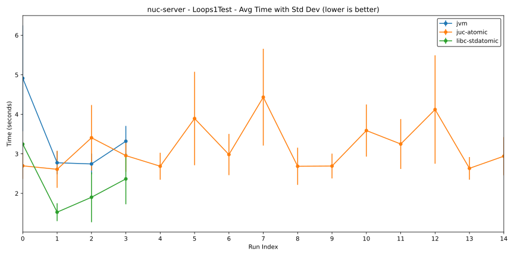
- ./logs/2026-05-09/nuc-server/Loops2Test.svg
  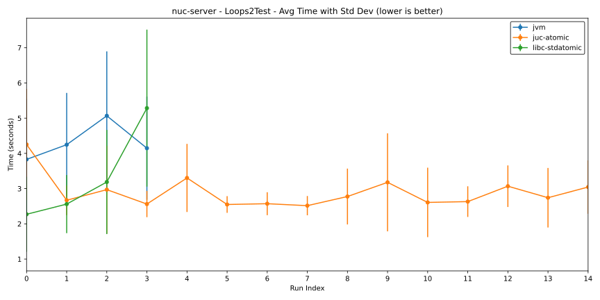
- ./logs/2026-05-09/nuc-server/Loops3Test.svg
  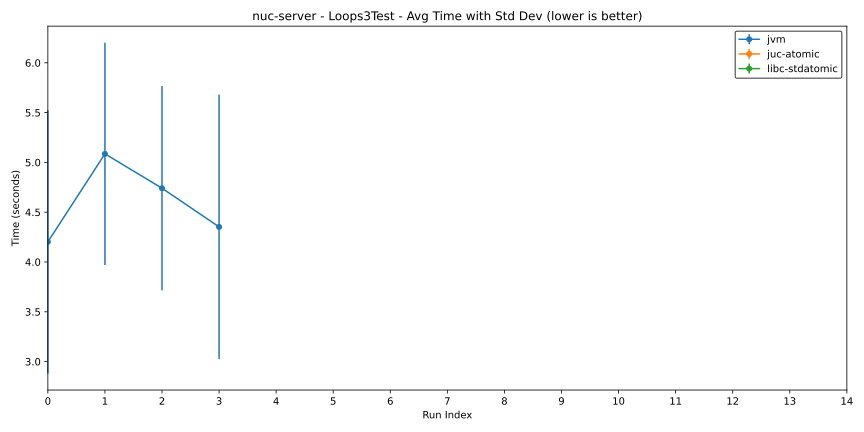
- ./logs/2026-05-09/nuc-server/Loops4Test.svg
  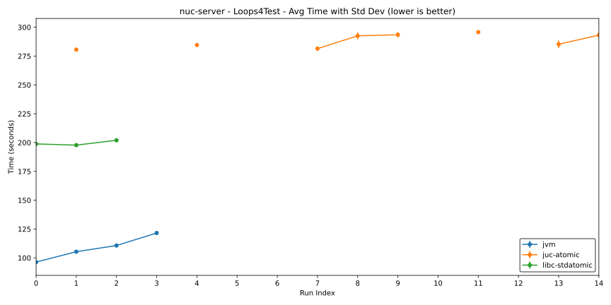

### Machine: Dev Server

- [setup](./logs/2026-05-09/dev-server/README.md)

- CPU: 10 cores (2.80 GHz), 20 threads
  - Arch: x86_64
- Memory: 64GB RAM (2933 MT/s)
- OS: Ubuntu 24.04
- JDK: Temurin Java 25.0.1
- LLVM: clang++ 18.1.3

| Suites     |     JVM | j.u.c.atomic | libc.stdatomic |
| ---------- | ------: | -----------: | -------------: |
| Loops1Test |  0.7942 |       2.0404 |         1.6510 |
| Loops2Test |  0.7756 |       2.1559 |         1.8323 |
| Loops3Test |  1.4087 |            x |              x |
| Loops4Test | 51.1692 |     147.1156 |       101.5637 |

- `x` means that all runs likely timed out, so we could not get a meaningful statistic for that test suite.

Plots for the Dev server:

- ./logs/2026-05-09/dev-server/Loops1Test.svg
  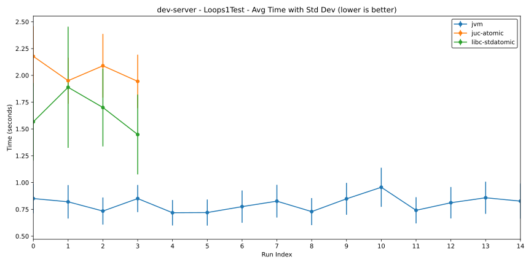
- ./logs/2026-05-09/dev-server/Loops2Test.svg
  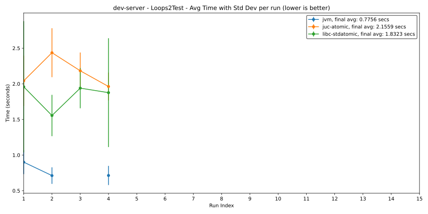
- ./logs/2026-05-09/dev-server/Loops3Test.svg
  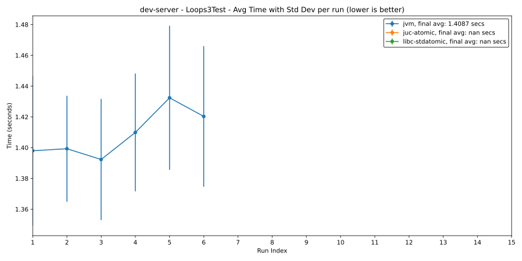
- ./logs/2026-05-09/dev-server/Loops4Test.svg
  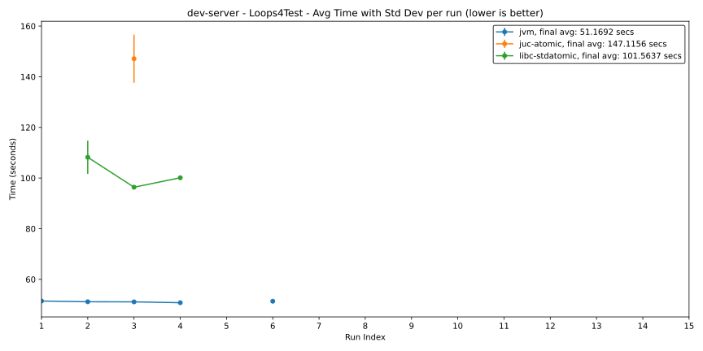

### Machine: Mac Mini

- [setup](./logs/2026-05-09/mac-mini/README.md)

- CPU: 6 perf cores (3.50 GHz), 4 eco cores (2.42 GHz), 10 threads
  - Arch: aarch64
- Memory: 32 GB (6400 MT/s)

| Suites     |            JVM | j.u.c.atomic | libc.stdatomic |
| ---------- | -------------: | -----------: | -------------: |
| Loops1Test |  2.233 ± 0.237 |          ??? |            ??? |
| Loops2Test |  2.194 ± 0.295 |          ??? |            ??? |
| Loops3Test |  1.556 ± 0.193 |          ??? |            ??? |
| Loops4Test | 36.383 ± 0.152 |          ??? |            ??? |

### Some other observations

1. Sometimes programs do not just time out; they also throw `java.util.concurrent.RejectedExecutionException` from `ForkJoinPool`, for example in this [log](./logs/2026-05-09/nuc-server/all-in-one-bench/juc-atomic/3.8.3-fast-juc-atomic-benchmark-starts-from-loops-3-test.log). I have seen this in different runs, but I cannot reproduce it consistently yet.
2. I also observed the following blocking-related warning on macOS:

   ```
   [20:22:36.867] [sandbox:59744] [ScalaNative GC|Warning] Waiting for 1 thread(s) to reach safepoint (30.0s elapsed)
   [20:22:36.867] [sandbox:59744] [ScalaNative GC|Warning] 1 thread(s) not reaching safepoint:
   [20:22:36.867] [sandbox:59744] [ScalaNative GC|Warning]   Thread id=6173782016, stackBottom=0x16ffc7000, state=Managed, alive=yes
   [20:22:36.867] [sandbox:59744] [ScalaNative GC|Warning] Possible causes:
     - Thread blocked in native code without @blocking annotation
     - Thread crashed without cleanup
     - Infinite loop in native code
     - Deadlock with resource held by waiting thread
   ```

   This warning appears in the [mac-mini juc-atomic log](./logs/2026-05-09/mac-mini/all-in-one-bench/juc-atomic/3.8.3-fast-juc-atomic-benchmark.log) and the [mac-mini libc-stdatomic log](./logs/2026-05-09/mac-mini/all-in-one-bench/libc-stdatomic/3.8.3-fast-libc-stdatomic-benchmark.log).

   I haven't put too much weight on this warning yet.

3. Few plots for those finished runs. (`nuc-server/standalone/juc-atomic/Loops{1,2,3}Test` completed almost all 50 runs)
   - Loops1Test
     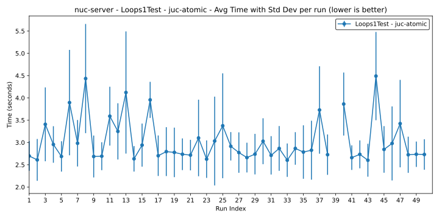
     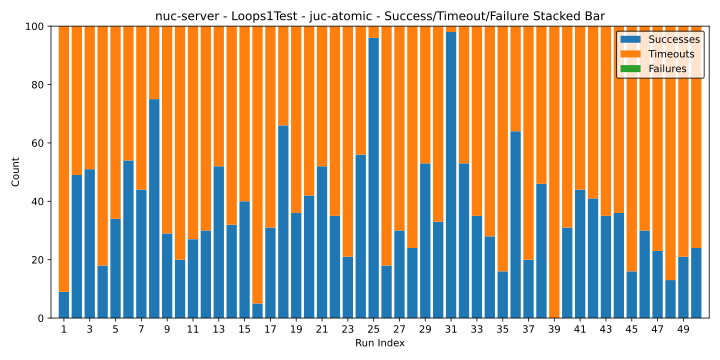
   - Loops2Test
     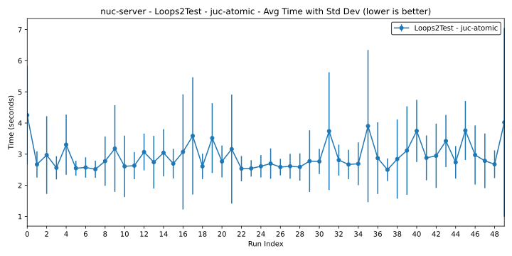
     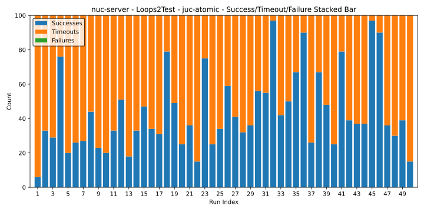
